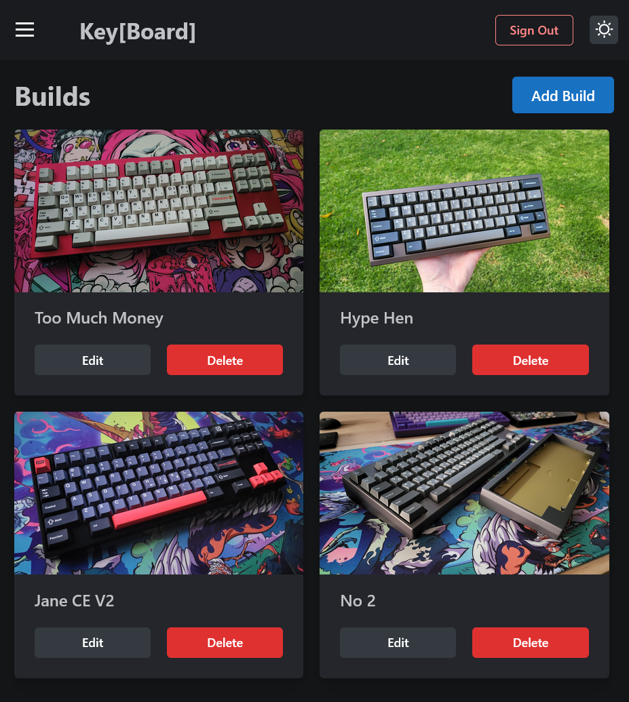

# Key"board" Inventory Project [](https://opensource.org/licenses/MIT)

## Description

A Fullstack inventory for keeping track of parts and builds for Custom Mechanical Keyboards.


## Screenshot



## Technologies

* TypeScript
* React 18
* [Mantine](https://mantine.dev/) - React component library
* Apollo Server and Client
* Nodejs
* GraphQL

## Future Development

* Sharing functionality so users can share their builds
* Account settings (profile picture etc)
* refine styling and desktop menu functionality

## Installation and deployment

To run locally you can do one of two things. There is already a server that is hosted on heroku, so inside of the client folder just:

```md
npm install
```

then run with

```md
npm start
```

otherwise to run completely locally you will need to swap out the link in the ApolloProvider.js file line 19 in client. Then run the above commands
in the client folder and  

```md
node index.js
```

in the server folder.

## Live Site

[https://sparkling-jalebi-05b27e.netlify.app/](https://sparkling-jalebi-05b27e.netlify.app/)


## License

MIT


## Links

[My Github Account](https://github.com/mattyd96)

[My Portfolio](https://mattyd.me)

[Email: matthewdcodes@gmail.com](mailto:matthewdcodes@gmail.com)